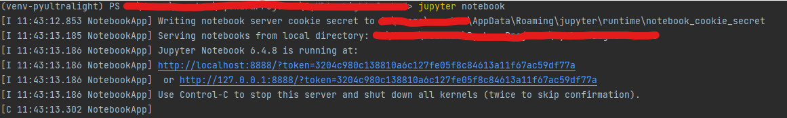

# PyUltraLight
PyUltraLight Repository


# Prerequisites

In order to run the Jupyter notebook, a number of Python prerequisites must first be installed. The full list of modules required by the main code and the notebook is:

numpy, numexpr, numba, h5py, pyfftw, time, sys, os, matplotlib, math, multiprocessing.

Run the following to install all necessary packages (using command line)
## For Windows
```commandline
python -m venv venv-pyultralight

.\venv-pyultralight\Scripts\activate

pip install -r .\dev_requirements.txt
```

## For OS-X
```commandline
python -m venv venv-pyultralight

source venv-pyultralight/bin/activate

pip install -r .\dev_requirements.txt
```

# Running Jupyter Notebook
```commandline
jupyter notebook
```
You should see an output


For more information refer to [Running a Jupyter Notebook](https://docs.jupyter.org/en/latest/running.html#running)

# More information

Instructions on basic setup and usage can be found here:
http://cosmology.blogs.auckland.ac.nz/pyultralight/

The complete code release paper can be found here:
https://arxiv.org/pdf/1807.04037.pdf
